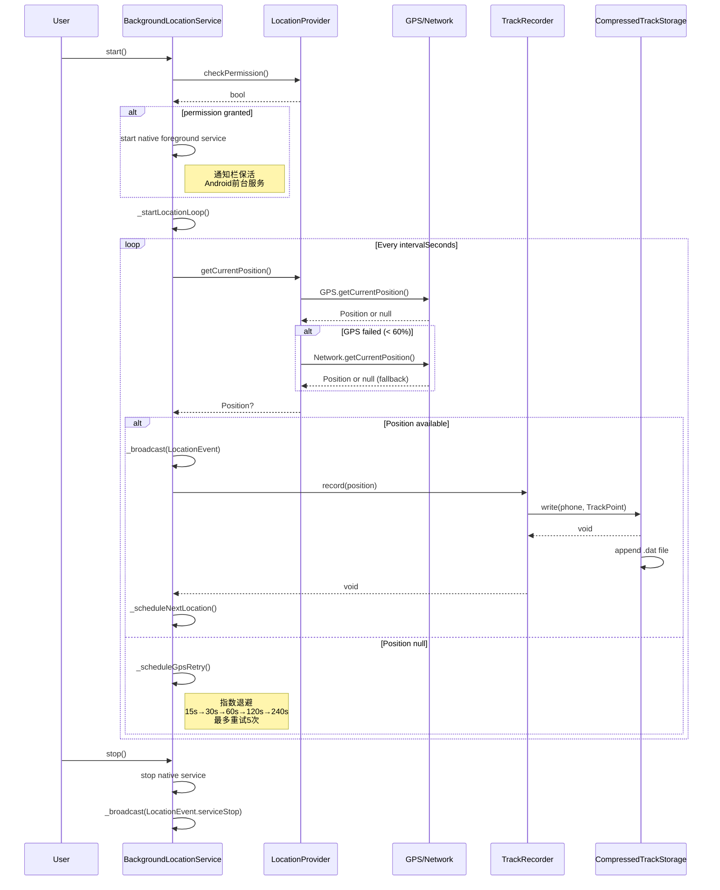
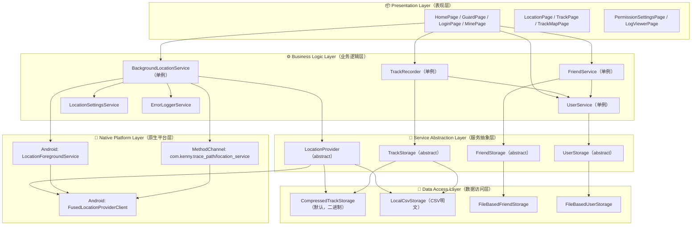
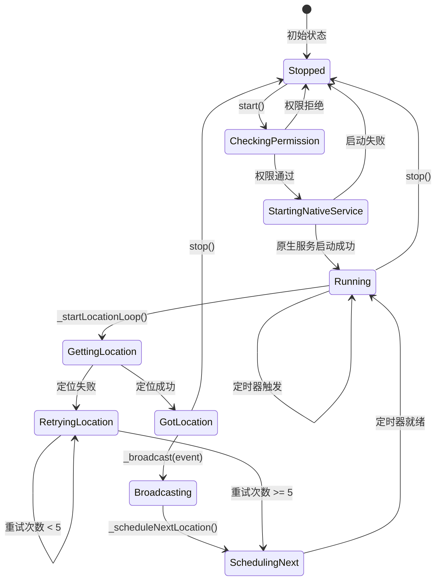

# trace_path UML Mermaid Diagrams
# These diagrams can be rendered in any Mermaid-compatible viewer (e.g., draw.io, VS Code Mermaid Preview, GitHub, etc.)

## 1. 类图 (Class Diagram)

```mermaid
classDiagram
    class BackgroundLocationService {
        <<Singleton>>
        - LocationProvider _locationProvider
        - LocationSettingsService _settingsService
        - UserService _userService
        - ErrorLoggerService _errorLogger
        - List~LocationCallback~ _subscribers
        - bool _isTracking
        - int _intervalSeconds
        + start()
        + stop()
        + subscribe(cb)
        + unsubscribe(cb)
        + getCurrentPosition()
        + _broadcast(event)
    }

    class TrackRecorder {
        <<Singleton>>
        - TrackStorage _storage
        + record(Position position)
        + readDay(String phone, int year, int month, int day)
        + setStorage(TrackStorage storage)
    }

    class FriendService {
        <<Singleton>>
        - List~Friend~ _friends
        - FriendStorage _storage
        + addFriend(friend)
        + removeFriend(phoneNumber)
        + updateFriendLocation(phone, lat, lng)
        + getFriends()
        + saveFriends()
    }

    class UserService {
        <<Singleton>>
        - User? _currentUser
        - UserStorage _storage
        + saveUser(user)
        + clearUser()
        + isLoggedIn
        + currentPhoneNumber
    }

    class LocationProvider {
        <<abstract>>
        + getCurrentPosition() Position?
        + checkPermission() bool
        + isLocationServiceEnabled() bool
        + dispose()
    }

    class GeolocatorLocationProvider {
        - ErrorLoggerService? _errorLogger
        + getCurrentPosition() Position?
        + checkPermission() bool
        + isLocationServiceEnabled() bool
    }

    class NativeLocationProvider {
        - ErrorLoggerService? _errorLogger
        + getCurrentPosition() Position?
        + checkPermission() bool
        + isLocationServiceEnabled() bool
    }

    class TrackStorage {
        <<abstract>>
        + write(String phone, TrackPoint point)
        + readDay(String phone, int year, int month, int day) List~TrackPoint~
        + deleteDay(String phone, int year, int month, int day)
        + syncToServer()
        + pullFromServer()
    }

    class CompressedTrackStorage {
        - TrackStorageManager _manager
        + write(String phone, TrackPoint point)
        + readDay(...) List~TrackPoint~
        + deleteDay(...)
        + getCompressionRatio() double
    }

    class LocalCsvStorage {
        - TrackStorageManager _manager
        + write(String phone, TrackPoint point)
        + readDay(...) List~TrackPoint~
        + deleteDay(...)
    }

    class Friend {
        <<Model>>
        - String phoneNumber
        - String name
        - String emoji
        - double? lat
        - double? lng
        - String? address
        - DateTime? lastUpdateTime
        + toJson()
        + fromJson()
    }

    class TrackPoint {
        <<Model>>
        - DateTime timestamp
        - double latitude
        - double longitude
        - double altitude
        - double speed
        - double accuracy
        + fromPosition(Position pos)
        + toLatLng()
        + toCsvLine()
    }

    class LocationEvent {
        <<Model>>
        - LocationEventType type
        - Position? position
        - String? errorMessage
        + position() bool
        + error() bool
        + serviceStart()
        + serviceStop()
    }

    %% Relationships
    BackgroundLocationService ..> LocationProvider : "uses (delegates)"
    BackgroundLocationService ..> TrackRecorder : "calls .record()"
    BackgroundLocationService ..> LocationSettingsService : "uses"
    BackgroundLocationService ..> UserService : "uses"
    BackgroundLocationService ..> ErrorLoggerService : "uses"

    TrackRecorder ..> TrackStorage : "has (composition)"
    TrackRecorder ..> UserService : "uses"

    FriendService ..> Friend : "manages"
    FriendService ..> UserService : "uses"

    GeolocatorLocationProvider --|> LocationProvider : "implements"
    NativeLocationProvider --|> LocationProvider : "implements"
    CompressedTrackStorage --|> TrackStorage : "implements"
    LocalCsvStorage --|> TrackStorage : "implements"
```

## 2. 时序图 (Sequence Diagram) - 定位更新流程

## 3. 架构图 (Architecture Diagram) - 模块分层

## 4. 状态图 - 定位服务状态机

